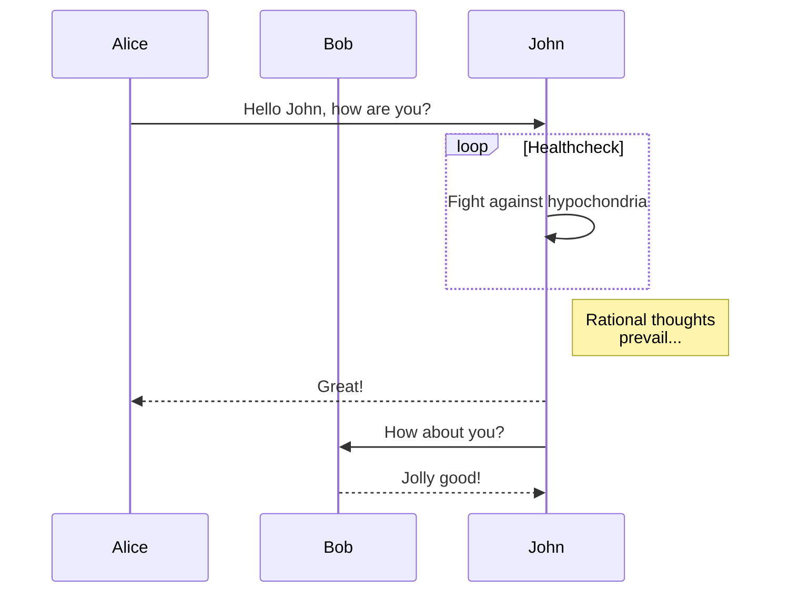

Usage
=====

## Basic Usage

Please [install Shiba](installation.md) at first.

Clicking an executable or application icon to start Shiba.  Below is an OS X example.


Then you can see a start window.  At first, let's make Shiba watch a markdown document.  There are 3 ways to do that.

1. You can see 'Drop file to window' message in the main window. Simply drop a file you want to preview.  Note that you can always drop down a file to window even if Shiba already watches other file.
2. Click the drop zone in main window.  A file chooser appears and you can choose a file to preview with it.
3. Please find the 'directory' icon and push it.  A dialog will be shown and you can specify a directory or markdown file to make Shiba watch.


When specifying a markdown file, Shiba will show the preview of it.  Below window is a preview of [this file](https://gist.github.com/rhysd/ffe61ad01f9a7a9fe69f).


After that, when you edit some lines of the file and save it, the preview will be automatically updated.  So you can write your markdown document with checking preview.

And you can scroll the window with `j` and `k` keys.  All operations can be done both with mouse and with keyboard.  Please see [key shortcuts document](shortcuts.md) for the detail.

If you want to change the watching file or directory, please push the 'directory' button again.  Or you can quit app by closing the window.


## Command Line Interface

You can use Shiba executable as command.  If you installed Shiba via [npm](https://www.npmjs.com/), you can already use `shiba` command anywhere.

```
$ shiba [--detach|--version] [{path}]
```

If `{path}` is given, Shiba will watch the path at first.  Otherwise, Shiba will start to watch the current working directory and show a start window.


## Lint

Shiba has integrated markdown linter.  When file is updated, Shiba will run linter automatically and report it if some error occurs.  You can access the lint result by '!' button in left menu.
At first, the '!' button is normal color as below.


When linter reports some errors, the button's color would be changed to red.


When you want to know the detail of lint errors, simply click the red button.  It shows the list of errors.


## Shortcuts

Keyboard shortcuts are available for **all** operations.
Please refer [shortcuts document](shortcuts.md).


## Using Your Favorite CSS and Code Highlighting

You can specify your favorite CSS file for styling markdown preview.  And you can also specify highlight theme for code block in markdown document.
Please refer [customization document](shortcuts.md).


## Outline Window


Clicking 'textboard' icon in menu or `o` shortcut will show an outline window.

In the outline window, you can see all section headers such as `# ...`, `## ...`, ...  You can move to the section by clicking it in the window.

And you can also find 'COPY OUTLINE' button.  When you click it, the outline can be copied to your clipboard as Markdown format.

In outline window, below local shortcuts are available and global shortcuts would be disabled.  Please see [the document](shortcuts.md#outline-window-shortcuts).

In addition, you can find the 'COPY OUTLINE' button at the bottom of outline window.  It copies the outline of markdown document (table of contents) to your system clipboard with markdown format.  You can simply paste it to add the outline to your document.


## Search Text


Clicking 'search' icon in menu or `s` shortcut will show a search box at top-right of the window.

In the search box, you can search text in the preview.

You can put the text in a text-form and input `Enter` key to search the text in current preview.  All matched text will be highlighted with yellow color and current active match will be highlighted with orange color.  You can move to next match with more `Enter` key.  You can also move to next/previous match with arrow buttons in the box.  Finally, you can close the box with 'close' button in the box.

All operations are available with buttons and key shortcuts.  Please see [the local shortcuts document](shortcuts.md#search-box-shortcuts).


## Clicking Links in Documents

### Link to local markdown file

When you click a link to local markdown document, Shiba shows the preview of the document _temporarily_.
'_temporarily_' means that Shiba still watches the original document before jump the link.  So you can back to the original document when original document is updated or 'reload' button is pushed.

### External link

When you click an external link (which starts with `http://` or `https://`), Shiba tends to open the link with external browser.  This behavior is mandatory in terms of security because pages in Electron are loaded outside sandbox.

### `#hash` link

When you click to the internal link to hash, page simply scrolls to the target. Note that links must be lower-case only. For example, each of these links:

    # Table of Contents
    * [Chapter 1](#chapter-1)
      * [Section A](#section-a)
      * [Section B](#section-b)
    * [Chapter 2](#chapter-2)
    * [Chapter 3](#chapter-3)

Will link to each of these headings:

    ## Chapter 1
      ### Section A
      ### Section B
    ## Chapter 2
    ## Chapter 3

### Link to local markdown file with modifier key

If you click a link to local markdown document with modifier key (Ctrl or Command), Shiba changes the watching path to the linked document.

## [mermaid.js](https://github.com/knsv/mermaid) Integration

Shiba can render a diagram, flowchart and gantt chart using [mermaid.js](https://github.com/knsv/mermaid).
Write diagram or flowchart definition in `mermaid` code block in markdown document.  Below is an example shown in mermaid.js document


<pre>
<code>

</code>
</pre>

## Math formula support using [katex](https://github.com/Khan/KaTeX)

Shiba can render a math formula using [katex](https://github.com/Khan/KaTeX).
Write formula in `katex` code block in markdown document.


Above formula is written in `katex` block as below.

<pre>
<code>
```katex
y = x + \sin(\pi) + \displaystyle \int e^x dx
```
</code>
</pre>


-----------------
[installation](installation.md) | [usage](usage.md) | [customization](customization.md) | [shortcuts](shortcuts.md) | [tips](tips.md)
