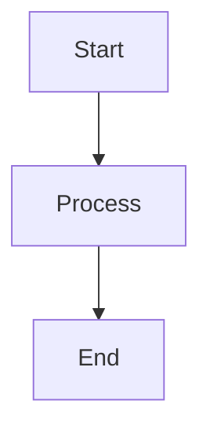

# Shiba User Guide

## Introduction

Shiba is a simple, performant Markdown preview browser designed for keyboard-centric workflow. It watches your files and automatically updates the preview as you edit.

## Features

- **GitHub-flavored Markdown** - Tables, emojis, alerts, math (MathJax), diagrams (mermaid)
- **Auto-reload** - Watches files/directories using OS-specific filesystem events
- **Keyboard-first** - All features accessible via keyboard shortcuts (type `?` to see all)
- **Auto-scroll** - Automatically scrolls to last modified position
- **Cross-platform** - macOS, Windows, Linux
- **Multiple windows** - Open multiple documents simultaneously
- **Customizable** - YAML config file for themes, shortcuts, custom CSS
- **Performance** - Core logic in Rust, view in TypeScript + React on platform WebView

## Installation

### Desktop App (Recommended)

**macOS**:
```bash
brew install --cask shiba
```

**Windows**:
```powershell
winget install rhysd.Shiba
# or download from GitHub Releases
```

**Linux**:
```bash
# Download from GitHub Releases
# Extract and run the AppImage or deb package
```

### Preview Version (Crate)

```bash
cargo install shiba-preview
```

Note: The crate version is a preview. For best experience, use the desktop app.

## Quick Start

### Open a Markdown File

```bash
# CLI usage
shiba README.md

# Or open without arguments and drag-drop files
shiba
```

### Keyboard Navigation

| Key | Action |
|-----|--------|
| `?` | Show all keyboard shortcuts |
| `j`/`k` | Scroll down/up |
| `G`/`gg` | Scroll to bottom/top |
| `/` | Search text |
| `n`/`N` | Next/previous search result |
| `h`/`l` | Go back/forward in history |
| `t` | Toggle table of contents |
| `b` | Toggle sidebar |
| `r` | Reload manually |
| `q` | Quit |

## Configuration

### Config File Location

- **macOS**: `~/Library/Application Support/Shiba/config.yml`
- **Windows**: `%APPDATA%\Shiba\config.yml`
- **Linux**: `~/.config/shiba/config.yml`

### Basic Configuration

```yaml
# ~/.config/shiba/config.yml

# Color theme: light, dark, or custom
theme: dark

# Font size
font_size: 16

# Enable/disable features
auto_scroll: true
show_sidebar: true
show_toc: true

# Custom CSS
custom_css: ~/path/to/custom.css

# Keyboard shortcuts
shortcuts:
  scroll_down: j
  scroll_up: k
  search: /
```

### Custom CSS

Create a CSS file to customize appearance:

```css
/* ~/path/to/custom.css */
body {
  max-width: 800px;
  margin: 0 auto;
  padding: 20px;
}

h1, h2 {
  color: #2c3e50;
}

code {
  background: #f4f4f4;
  padding: 2px 6px;
}
```

## Supported Markdown Features

### GitHub Flavored Markdown

```markdown
# Headers

**Bold** and *italic*

- List items
- More items

[Links](https://example.com)


| Tables | Are | Supported |
|--------|-----|-----------|
| Cell 1 | Cell 2 | Cell 3 |
```

### Alerts

```markdown
> [!NOTE]
> Useful information

> [!TIP]
> Helpful advice

> [!WARNING]
> Be careful

> [!IMPORTANT]
> Critical info

> [!CAUTION]
> Serious warning
```

### Math Expressions (MathJax)

```markdown
Inline math: $E = mc^2$

Block math:
$$
\int_{-\infty}^{\infty} e^{-x^2} dx = \sqrt{\pi}
$$
```

### Diagrams (mermaid)

```markdown

```

## File Watching

Shiba automatically watches for file changes:

- **Single file**: Opens and watches the specified file
- **Directory**: Watches all `.md` files in the directory
- **Recursive**: Optionally watches subdirectories

### Manual Reload

If auto-reload doesn't work:
- Press `r` to reload manually
- Check file permissions
- Ensure filesystem events are supported

## Multiple Windows

Open multiple documents:

```bash
# Open multiple files in separate windows
shiba README.md CONTRIBUTING.md &

# Or use File → New Window from existing window
```

## Performance Tips

### Large Files

For large Markdown files (>1MB):
- Disable auto-scroll in config
- Use `show_sidebar: false`
- Consider splitting into multiple files

### Many Files

When watching directories with many files:
- Use filters to limit watched files
- Exclude `node_modules`, `.git`, etc.

### Troubleshooting Slow Rendering

1. Check if MathJax/mermaid are causing slowdown
2. Disable custom CSS temporarily
3. Reduce font size
4. Close unused windows

##常见问题

### Auto-reload Not Working

1. Check file permissions
2. Ensure file is saved (some editors have auto-save delay)
3. Try manual reload (`r`)
4. Restart Shiba

### Math Not Rendering

- Ensure MathJax is enabled (default: on)
- Check syntax: use `$...$` for inline, `$$...$$` for block
- Some Markdown parsers require blank lines around block math

### Custom CSS Not Loading

- Verify file path is correct
- Check CSS syntax
- Restart Shiba after changing custom CSS path

### Keyboard Shortcuts Not Working

- Ensure Shiba window is focused
- Check for conflicts with system shortcuts
- Customize in config file if needed

## Comparison with Alternatives

| Feature | Shiba | Typora | MarkText |
|---------|-------|--------|----------|
| **Price** | Free | $15 | Free |
| **Auto-reload** | ✅ | ❌ | ⚠️ |
| **Keyboard-first** | ✅ | ⚠️ | ⚠️ |
| **Multiple windows** | ✅ | ⚠️ | ❌ |
| **Custom CSS** | ✅ | ✅ | ✅ |
| **Math support** | ✅ | ✅ | ✅ |
| **Mermaid** | ✅ | ❌ | ✅ |
| **Open source** | ✅ | ❌ | ✅ |

## Advanced Usage

### CLI Options

```bash
shiba --help

# Common options:
shiba file.md              # Open specific file
shiba -w directory/        # Watch directory
shiba --theme light        # Override theme
shiba --no-auto-scroll     # Disable auto-scroll
```

### Integration with Editors

#### VS Code

Add to `settings.json`:
```json
{
  "files.watcherExclude": {
    "**/.git/**": true
  }
}
```

Then use Shiba side-by-side with VS Code.

#### Vim/Neovim

```vim
" Auto-save and switch to Shiba window
autocmd BufWritePost *.md silent !shiba % &
```

#### Emacs

```elisp
;; Open Shiba on save
(add-hook 'markdown-mode-hook
          (lambda ()
            (add-hook 'after-save-hook
                      (lambda () (start-process "shiba" nil "shiba" (buffer-file-name)))
                      nil t)))
```

## Community

- **Repository**: https://github.com/rhysd/Shiba
- **Issues**: https://github.com/rhysd/Shiba/issues
- **Discussions**: https://github.com/rhysd/Shiba/discussions

## Contributing

Contributions welcome! Areas needing help:
- Documentation improvements
- Bug reports and fixes
- Feature requests
- Platform-specific testing

---

*Community contribution - unofficial user guide*
