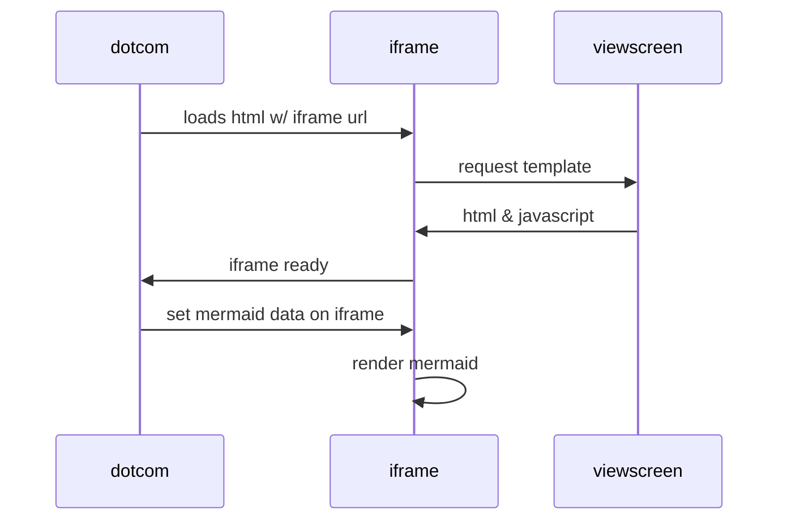

Test
====

This is an example text to test Shiba's Markdown rendering. See [readme](./README.md) for more details.

| Animal | Strong                  |            Italic |       Emoji       | URL                                 |
|--------|:------------------------|------------------:|:-----------------:|-------------------------------------|
| Dog    | **Dog**                 | _Dog_ _Dog_ _Dog_ |       :dog:       | https://www.google.com/search?q=dog |
| Cat    | **Cat** **Cat** **Cat** |             _Cat_ | :cat: :cat: :cat: | https://www.google.com/search?q=cat |

Seevral inline parts: *emphasis* and **strong** and ~~strike~~

## Highlight

```rust
fn say_hello<D: fmt::Display>(world: D) -> () {
    println!("Hello, ", world);
}
```

## Lists

Unordered:

- item 1
  - nested 1
  - nested 2
- item 2
- item 3

Ordered:

1. item 1
  1. nested 1
  2. nested 2
2. item 2
3. item 3

Tasks:

- [ ] Complete this app
- [x] Start development

## Mathematical expression using `$`

Inline math $y=x^2$!


$$\left( \sum_{k=1}^n a_k b_k \right)^2 \leq \left( \sum_{k=1}^n a_k^2 \right) \left( \sum_{k=1}^n b_k^2 \right)$$

```math
\left( \sum_{k=1}^n a_k b_k \right)^2 \leq \left( \sum_{k=1}^n a_k^2 \right) \left( \sum_{k=1}^n b_k^2 \right)
```

## Mermaid chart/diagram



## Raw HTML

<div>
    <p>This is raw <strong>paragraph</strong></p>
</div>

<script>alert('this should be removed');</script>

- <a name="#raw-html">Raw hash link</a>
- <a href="https://example.com">Raw external link</a>
- <a href="../README.md">Raw local link</a>

Raw image:

